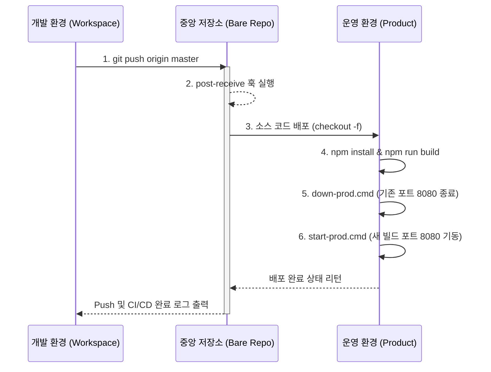

# PMOTools 시스템 운영 환경 및 CI/CD 아키텍처

본 문서는 PMOTools 프로젝트의 개발/운영 환경 분리 체계, 자동 배포(CI/CD) 파이프라인, 그리고 데이터베이스 백업 아키텍처를 정의합니다.

---

## 1. 환경 구성 아키텍처 (Environment Architecture)

시스템은 단일 물리 서버(또는 로컬 PC) 내에서 논리적인 디렉토리 분리 및 포트 분리를 통해 **개발(DEV)** 환경과 **운영(PROD)** 환경을 완전히 독립적으로 운영합니다.

### 1.1 디렉토리 및 포트 구조

| 구분 | 경로 (Path) | 사용 포트 | 환경 변수 파일 | 역할 |
|---|---|---|---|---|
| **DEV (개발)** | `d:\workspace\pmotools` | `3020` | `.env` | 소스 코드 작성, 테스트, 로컬 실행 환경 |
| **PROD (운영)** | `d:\product\pmotools` | `8080` | `.env.production` | 실제 사용자 서비스 제공 환경 |
| **REPO (중앙)** | `d:\repo\pmotools.git` | N/A | N/A | Git Bare Repository (CI/CD 중계소) |
| **BACKUP (백업)** | `d:\product\db_backups` | N/A | N/A | DB 자동 백업 파일 보관소 (.sql) |

### 1.2 서비스 통제 스크립트

각 환경은 독립된 구동 및 종료 스크립트를 가집니다.
- **DEV**: `start.cmd`, `down.cmd` (내부적으로 Next.js dev 모드 및 로컬 DB 구동 처리)
- **PROD**: `start-prod.cmd`, `down-prod.cmd` (Next.js production 빌드 실행 및 프로세스 종료 제어)

---

## 2. CI/CD 파이프라인 (자동 배포 체계)

Windows 환경에서의 로컬 CI/CD 파이프라인은 별도의 외부 서비스(Jenkins, GitHub Actions 등) 없이 **Git Server Side Hooks (`post-receive`)**를 활용하여 경량화되고 즉각적인 배포를 지원합니다.

### 2.1 배포 워크플로우 (Deployment Workflow)

1. **개발 완료 및 푸시 (Push)**: 개발 환경(`workspace`)에서 작업을 마치고 `git push origin master` (또는 `npm run deploy:prod`)를 실행합니다.
2. **이벤트 감지 (Hook Trigger)**: 중앙 저장소(`repo`)의 `post-receive` 훅이 push 이벤트를 감지합니다.
3. **소스 동기화 (Checkout)**: 최신 master 브랜치 코드를 운영 디렉토리(`product`)로 강제 체크아웃(`git checkout -f`)합니다.
4. **의존성 설치 및 빌드 (Build)**: 운영 환경에서 `npm install` 및 `npm run build`가 자동으로 실행됩니다.
5. **무중단 재시작 (Restart)**: 빌드 완료 후 `down-prod.cmd`로 기존 프로세스를 죽이고, `start-prod.cmd`로 새 버전의 서버를 백그라운드로 띄웁니다.



---

## 3. 데이터베이스 (PostgreSQL) 자동 백업 체계

랜섬웨어 감염, 하드웨어 장애, 휴먼 에러 등으로 인한 데이터 유실을 방지하기 위해 OS 레벨의 스케줄러와 DB 자체 덤프 기능을 결합한 자동 백업 체계를 구성했습니다.

### 3.1 백업 파이프라인 구조

- **백업 스크립트**: `d:\workspace\pmotools\scripts\backup-db.ps1` (버전 관리 대상)
- **실행 트리거**: Windows 작업 스케줄러 (Task Scheduler)
- **백업 방식**: `pg_dump` 유틸리티를 활용한 정기 논리 백업(Logical Backup)

### 3.2 백업 운영 정책

1. **실행 주기**: 매일 새벽 3시 (AM 03:00) 1회 실행
2. **인증 보안**: `.env.production` 파일 내의 `DATABASE_URL`을 스크립트가 런타임에 파싱하여 DB에 접속하므로 별도의 비밀번호 노출 불필요
3. **보관 정책 (Retention)**: 백업된 파일은 `d:\product\db_backups`에 `pmotools_db_YYYYMMDD_HHMMSS.sql` 형식으로 저장되며, 디스크 용량 관리 차원에서 **생성일 기준 15일이 경과한 파일은 자동 삭제(Rotation)** 됩니다.

```mermaid
graph TD
    A[Windows 작업 스케줄러] -->|매일 03:00 AM| B(backup-db.ps1 스크립트 실행)
    B --> C{환경 변수 파싱}
    C -->|.env.production| D[DATABASE_URL 확보]
    D --> E[pg_dump 실행]
    E --> F[d:\product\db_backups\ 저장]
    F --> G{로테이션 검사}
    G -->|15일 경과 파일| H[자동 삭제 (Delete)]
    G -->|최신 파일| I[보존 (Keep)]
```

---

## 4. 장애 및 복구 (Disaster Recovery) 가이드

1. **운영 서버 비정상 종료 시**: 
   - `d:\product\pmotools\start-prod.cmd` 수동 실행. 포트(8080) 충돌 시 `down-prod.cmd` 선행 실행 필요.
2. **DB 복구(Restore) 필요 시**:
   - `d:\product\db_backups` 폴더 내 가장 최근의 `.sql` 파일을 확보.
   - `psql -U <username> -d <dbname> -f <백업파일명.sql>` 명령으로 수동 복구 수행.
3. **배포 실패 시**:
   - 로컬 터미널에서 `git push origin master` 로그를 확인하여 빌드 단계(`Next.js build`)에서의 TypeScript 에러, Lint 에러 여부를 점검. 수정 후 다시 푸시하면 자동으로 파이프라인이 재가동됨.
