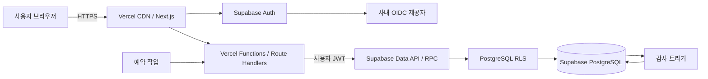
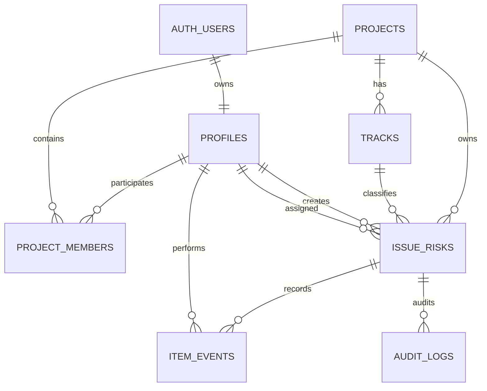

# 이슈·리스크 관리 시스템 설계서

> **보관 문서:** 이 문서는 Firebase 전환 이전의 초기 설계안입니다(Prisma 미사용 등 세부 스택은 최신이 아님).
> 현재 구현 기준은 `docs/PMS_캘린더기반_재개발계획서.md`입니다 — Supabase/PostgreSQL로 되돌아왔지만 스택 세부 사항(ORM=Prisma, 인증=Auth.js)이 다릅니다.

## 1. 설계 목표

현재 단일 HTML 프로토타입을 여러 사용자가 동시에 사용하는 서버 기반 PMO 웹 애플리케이션으로 전환한다.

- 서버가 데이터와 업무 규칙의 단일 원본(Source of Truth)이 된다.
- 로그인 사용자와 프로젝트별 권한을 관리한다.
- 모든 변경 이력을 추적하고 동시 수정 충돌을 방지한다.
- 현재 프로토타입의 대시보드, 등록, 목록, 상세, 상태 변경 기능을 유지한다.
- 초기 운영은 단순한 모듈러 모놀리스로 구성하고 필요할 때만 확장한다.

## 2. 범위

### MVP

- 사내 SSO 또는 OIDC 로그인
- 프로젝트/Track별 사용자 권한
- 이슈·리스크 등록, 조회, 수정
- 상태 및 에스컬레이션 레벨 변경
- 코멘트와 변경 이력
- 검색, 필터, 정렬, 페이지네이션
- KPI, 유형별 집계, 확률×영향 매트릭스
- 3영업일 이상 정체 항목 산출
- 감사 로그와 CSV 내보내기

### 2단계

- 이메일/메신저 알림
- 첨부파일
- 결재 또는 승인 워크플로
- 사용자 정의 분류/Track/에스컬레이션 규칙 관리 화면
- SLA 리포트 및 정기 보고서

## 3. 권장 기술 구조

| 영역 | 권장 기술 | 선택 이유 |
|---|---|---|
| 웹/호스팅 | Next.js + React + TypeScript / Vercel | 화면과 서버 API를 한 저장소에서 배포 |
| API | Vercel Functions에서 실행하는 Next.js Route Handler | 별도 API 서버 운영 불필요 |
| 데이터베이스 | Supabase Cloud PostgreSQL | 관리형 Postgres, 백업, RLS 제공 |
| DB 접근 | `@supabase/ssr` + Supabase Data API/RPC | 사용자 세션과 RLS를 일관되게 적용 |
| 인증 | Supabase Auth + OIDC/SSO 제공자 | SSR 쿠키 세션과 DB 사용자 식별 통합 |
| 스키마 관리 | Supabase CLI SQL migration | 스키마, 함수, 트리거, RLS 정책을 코드로 관리 |
| 검증 | Zod | 클라이언트와 API 입력 규칙 공유 |
| 테스트 | Vitest, Jest, Playwright | 도메인·API·사용자 흐름 검증 |
| 배포 | Docker 컨테이너 + 관리형 PostgreSQL | 환경 재현성과 백업 운영 단순화 |

초기에는 Prisma, Redis, 메시지 큐, 마이크로서비스를 도입하지 않는다. 예약 알림이 필요해지면 Vercel Cron 또는 Supabase 예약 작업을 검토한다.

## 4. 논리 아키텍처



브라우저는 테이블에 직접 쓰지 않는다. 조회는 Server Component 또는 Route Handler, 변경은 Route Handler를 통과한다. Route Handler는 로그인 사용자의 JWT로 Supabase에 접근하며 애플리케이션 권한 검사와 PostgreSQL RLS를 모두 적용한다. 원자적 변경은 PostgreSQL RPC 함수와 트리거로 보장한다.

## 5. 화면 및 책임 분리

| 화면 | 주요 책임 |
|---|---|
| 인증 확인 | 세션 확인 중 정적 로딩 화면만 표시하고 로그인 화면과 분리 |
| 대시보드 | KPI, 위험 매트릭스, 유형별 현황, 정체 항목 조회 |
| 신규 등록 | 입력 검증, 서버가 제안한 에스컬레이션 레벨 확인 후 등록 |
| 전체 목록 | 서버 검색, 필터, 정렬, 페이지네이션 |
| 상세 화면 | 기본 정보, 상태/레벨 변경, 코멘트 및 이력 표시 |
| 관리 화면(2단계) | 프로젝트, Track, 분류, 사용자 권한 관리 |

최상위 페이지는 데이터 조립과 화면 전환만 담당한다. 실제 마크업은 화면 컴포넌트로 분리하고, API 호출과 업무 로직은 서비스·훅·도메인 모듈에 둔다.

## 6. 권한 모델

| 역할 | 조회 | 등록 | 본인 항목 수정 | 전체 항목 수정 | 권한/기준정보 관리 |
|---|---:|---:|---:|---:|---:|
| Viewer | O | X | X | X | X |
| Member | O | O | O | X | X |
| PM | O | O | O | O | X |
| PMO Admin | O | O | O | O | O |

- 사용자는 프로젝트 단위로 역할을 가진다.
- 서버는 모든 API 요청에서 프로젝트 멤버십과 역할을 검사한다.
- C-Level 레벨 변경 권한은 PM 이상으로 제한하는 정책을 기본값으로 둔다.
- 삭제는 MVP에서 제공하지 않고 `archived_at`을 이용한 보관 처리만 허용한다.

## 7. 핵심 데이터 모델

### 7.1 관계



### 7.2 테이블

#### `profiles`

- `id UUID PK`: 애플리케이션 사용자 식별자
- `auth_user_id UUID UNIQUE`: 로컬에서는 nullable, Supabase 전환 후 `auth.users.id` FK 적용
- `email VARCHAR UNIQUE`
- `name VARCHAR`
- `department VARCHAR NULL`
- `is_active BOOLEAN`
- `created_at`, `updated_at TIMESTAMPTZ`

로그인 자격 증명과 외부 IdP 식별자는 Supabase의 `auth.users`가 관리하고, 애플리케이션은 공개 가능한 업무 프로필만 `profiles`에 둔다. 로컬 PostgreSQL 단계에서는 고정 개발 사용자를 사용하고 클라우드 전환 migration에서 Auth FK를 활성화한다.

#### `projects`

- `id UUID PK`
- `code VARCHAR UNIQUE`
- `name VARCHAR`
- `timezone VARCHAR` 기본값 `Asia/Seoul`
- `stale_business_days INT` 기본값 `3`
- `created_at`, `updated_at TIMESTAMPTZ`

#### `project_members`

- `project_id UUID FK`
- `user_id UUID FK`
- `role ENUM(viewer, member, pm, pmo_admin)`
- 복합 PK: `(project_id, user_id)`

#### `tracks`

- `id UUID PK`
- `project_id UUID FK`
- `code VARCHAR`
- `name VARCHAR`
- `sort_order INT`
- `is_active BOOLEAN`
- 유일키: `(project_id, code)`

#### `common_code_groups`

- `id UUID PK`
- `project_id UUID FK`
- `code`, `label`, `description`, `sort_order`, `is_active`
- `is_system`: 이슈관리 필수 그룹 여부
- 유일키: `(project_id, code)`

#### `common_codes`

- `id UUID PK`
- `project_id UUID FK`
- `group_id UUID FK -> common_code_groups.id`
- `code`, `label`, `sort_order`, `is_active`
- `metadata JSONB`: 에스컬레이션 최소 점수 등 그룹별 설정
- 유일키: `(group_id, code)`
- 신규 애플리케이션 데이터는 유형·Track·에스컬레이션을 이 테이블의 FK로 참조한다.

#### `issue_risks`

- `id UUID PK`: 내부 식별자
- `display_id VARCHAR UNIQUE`: 사용자 표시값, 예: `IR-2026-000001`
- `project_id UUID FK`
- `track_code_id UUID FK -> common_codes.id`
- `kind ENUM(issue, risk)`
- `category_code_id UUID FK -> common_codes.id`
- `title VARCHAR(200)`
- `description TEXT`
- `probability ENUM(low, medium, high)`: 이슈는 서버에서 `high`로 고정
- `impact ENUM(low, medium, high)`
- `exposure_text VARCHAR(500) NULL`
- `owner_user_id UUID FK NULL`
- `owner_text VARCHAR(100) NULL`: 초기 이관 또는 외부 담당자용
- `escalation_code_id UUID FK -> common_codes.id`
- `status ENUM(registered, in_progress, resolved, on_hold)`
- `created_by UUID FK`
- `version INT`: 낙관적 잠금용
- `created_at`, `updated_at`, `resolved_at`, `archived_at TIMESTAMPTZ NULL`

#### `item_events`

- `id UUID PK`
- `item_id UUID FK`
- `event_type ENUM(created, comment, status_changed, level_changed, edited, archived)`
- `actor_id UUID FK`
- `body TEXT NULL`
- `before_data JSONB NULL`
- `after_data JSONB NULL`
- `created_at TIMESTAMPTZ`

#### `audit_logs`

- `id UUID PK`
- `project_id`, `item_id`, `actor_id UUID`
- `action VARCHAR`
- `request_id VARCHAR`
- `ip_hash VARCHAR NULL`
- `before_data`, `after_data JSONB`
- `created_at TIMESTAMPTZ`

`item_events`는 사용자가 보는 업무 이력이고, `audit_logs`는 수정할 수 없는 운영 감사 기록이다.

### 7.3 주요 인덱스

- `issue_risks(project_id, status, updated_at)`
- `issue_risks(project_id, kind, category)`
- `issue_risks(project_id, probability, impact)`
- `issue_risks(owner_user_id, status)`
- `item_events(item_id, created_at DESC)`
- 제목·내용 검색은 초기 `ILIKE`, 데이터 증가 시 PostgreSQL 전문 검색 인덱스로 전환

### 7.4 RLS 정책 기준

| 테이블 | 조회 | 생성/수정 |
|---|---|---|
| `profiles` | 본인 또는 같은 프로젝트 구성원 | 본인 제한 필드, 관리자는 활성 상태 관리 |
| `projects`, `tracks` | 해당 프로젝트 구성원 | PMO Admin |
| `project_members` | 해당 프로젝트 구성원 | PMO Admin |
| `issue_risks` | 해당 프로젝트 구성원 | Member는 생성·본인 항목 수정, PM 이상은 전체 수정 |
| `item_events` | 해당 항목 조회 권한 보유자 | 직접 INSERT 금지, 승인된 RPC만 실행 |
| `audit_logs` | PMO Admin만 조회 | 직접 INSERT/UPDATE/DELETE 금지, 트리거 전용 |

- 모든 정책은 `auth.uid()`와 `project_members`를 기준으로 프로젝트 경계를 검사한다.
- RLS 정책에 사용하는 `project_id`, `user_id`에는 인덱스를 생성한다.
- 대시보드용 View를 공개 스키마에 둘 경우 `security_invoker = true`를 적용한다.

## 8. 서버 업무 규칙

### 에스컬레이션 제안

- 확률: 하=1, 중=2, 상=3
- 영향: 하=1, 중=2, 상=3
- 이슈는 이미 발생했으므로 확률 점수를 항상 3으로 계산한다.
- 점수 1~3: PM, 4~6: 본부장, 7~9: C-Level
- 수동 조정은 가능하되 변경자와 사유를 이력에 남긴다.

### 상태

- 기본 상태는 `registered`이다.
- 열린 상태는 `registered`, `in_progress`이다.
- `resolved` 전환 시 `resolved_at`을 기록한다.
- 해결된 항목을 다시 열면 `resolved_at`을 비우고 이력을 남긴다.

### 정체 판정

- 열린 항목의 `updated_at` 이후 경과한 영업일이 프로젝트 기준값 이상이면 정체로 판정한다.
- MVP 영업일은 토·일을 제외한다. 공휴일 제외가 필요하면 `business_holidays` 테이블을 추가한다.
- 화면 표기와 서버 계산은 모두 동일한 API 결과를 사용한다.

### 원자적 변경과 동시 수정

- 수정 요청에 현재 `version`을 포함한다.
- 서버의 버전과 다르면 `409 Conflict`를 반환하고 최신 데이터를 제공한다.
- 등록·상태 변경·레벨 변경은 PostgreSQL RPC 함수로 실행한다.
- 성공 시 하나의 DB 트랜잭션 안에서 본문, 버전, 이벤트를 함께 저장한다.
- 감사 로그는 DB 트리거가 변경 전후 값을 기록하여 애플리케이션 코드 누락을 방지한다.

## 9. REST API 설계

기본 경로는 `/api/v1`이며 모든 응답은 `requestId`를 포함한다. Route Handler는 Supabase SSR 쿠키에서 사용자를 확인하고 사용자 JWT가 적용된 클라이언트로 Data API/RPC를 호출한다.

| 메서드/경로 | 기능 | 최소 역할 |
|---|---|---|
| `GET /me` | 로그인 사용자와 프로젝트 권한 | 로그인 |
| `GET /projects` | 접근 가능한 프로젝트 목록 | 로그인 |
| `GET /projects/:projectId/dashboard` | KPI와 매트릭스 집계 | Viewer |
| `GET /projects/:projectId/items` | 검색/필터/정렬/페이지 조회 | Viewer |
| `POST /projects/:projectId/items` | 이슈·리스크 등록 | Member |
| `GET /items/:itemId` | 상세와 최근 이력 조회 | Viewer |
| `PATCH /items/:itemId` | 기본 정보 수정 | Member/PM |
| `PATCH /items/:itemId/status` | 상태 변경 | Member/PM |
| `PATCH /items/:itemId/escalation` | 레벨 변경 | PM |
| `POST /items/:itemId/comments` | 코멘트 추가 | Member |
| `POST /items/:itemId/archive` | 항목 보관 | PM |
| `GET /projects/:projectId/items/export.csv` | 필터 결과 내보내기 | PM |

목록 쿼리 예시:

```text
GET /api/v1/projects/{projectId}/items?kind=risk&status=in_progress&category=cost&q=지연&page=1&pageSize=30&sort=-updatedAt
```

오류 형식:

```json
{
  "error": {
    "code": "VERSION_CONFLICT",
    "message": "다른 사용자가 먼저 수정했습니다.",
    "fieldErrors": {}
  },
  "requestId": "req_..."
}
```

## 10. 프런트엔드 상태 및 데이터 흐름

- 서버 데이터는 TanStack Query로 조회·캐시·무효화한다.
- 등록/수정 폼은 React Hook Form과 공유 Zod 스키마를 사용한다.
- 검색 조건은 URL 쿼리로 유지하여 새로고침과 링크 공유가 가능하게 한다.
- 서버 데이터 전체를 브라우저 저장소에 복제하지 않는다.
- `localStorage`는 테마나 마지막 선택 프로젝트 같은 비업무 설정에만 사용한다.
- API 오류, 로딩, 빈 결과, 권한 없음, 버전 충돌 상태를 각각 분리한다.

## 11. 보안 및 운영

- 전 구간 HTTPS, Secure/HttpOnly/SameSite 쿠키 사용
- Supabase Auth SSR 쿠키 세션과 PKCE 흐름 사용
- 모든 입력을 서버에서 다시 검증하고 일반 데이터 접근은 Supabase Data API/RPC만 사용
- `public` 스키마의 모든 업무 테이블에 RLS를 명시적으로 활성화
- 프로젝트 단위 접근 제어를 Route Handler와 RLS 정책 양쪽에서 적용
- 일반 요청은 로그인 사용자의 JWT를 사용하고 Supabase Secret Key는 관리자용 서버 작업에만 사용
- Publishable Key는 클라이언트 사용이 가능하지만 Secret Key와 DB 비밀번호는 Vercel 서버 환경변수에만 저장
- 로그인·쓰기 API 속도 제한, 보안 헤더, 민감정보 로그 마스킹
- Supabase 운영 DB 일 단위 백업, 필요 시 PITR 적용, 월 1회 복구 훈련
- Supabase Storage를 추가하면 DB 백업과 별도로 객체 백업 정책을 운영
- 스키마 변경 전 백업과 사용자 승인, 순방향 마이그레이션 사용
- 구조화 로그에 `requestId`, 사용자, 프로젝트, 작업, 결과 기록
- 상태 점검: `/api/health/live`, `/api/health/ready`

### 11.1 클라우드 배치

- Vercel Production은 운영 Supabase 프로젝트만 연결한다.
- Vercel Preview는 별도의 Supabase Staging 프로젝트 또는 Supabase Branch를 연결하며 운영 DB에 연결하지 않는다.
- Vercel Functions 실행 리전은 Supabase 프로젝트와 동일하거나 가장 가까운 리전으로 고정한다.
- 정적 자산은 Vercel CDN에서 제공하고 동적 업무 요청만 Functions로 처리한다.
- 서버리스 런타임에서 직접 Postgres 연결이 필요한 예외 작업은 Supavisor Transaction Pooler를 사용한다.
- 마이그레이션과 `pg_dump`는 런타임 연결과 분리된 Direct/Session 연결을 사용한다.

### 11.2 환경변수

| 변수 | 노출 범위 | 용도 |
|---|---|---|
| `NEXT_PUBLIC_SUPABASE_URL` | 브라우저/서버 | Supabase 프로젝트 URL |
| `NEXT_PUBLIC_SUPABASE_PUBLISHABLE_KEY` | 브라우저/서버 | RLS 적용 공개 키 |
| `SUPABASE_SECRET_KEY` | 서버 전용, 선택 | 예약 작업과 제한된 관리자 작업 |
| `SUPABASE_DB_URL` | CI 마이그레이션 전용 | 스키마 배포/덤프 연결 |
| `APP_URL` | 서버 | 인증 콜백과 절대 URL 생성 |

- Vercel의 Development, Preview, Production 환경값을 분리한다.
- `.env*` 파일과 비밀값은 저장소에 커밋하지 않는다.
- 기존 `anon`/`service_role` 키 대신 신규 Publishable/Secret Key 체계를 기준으로 한다.

### 11.3 배포 순서

1. 로컬 Supabase에서 migration, RLS, RPC 테스트를 완료한다.
2. Staging DB 백업과 `supabase db push --dry-run` 결과를 확인한다.
3. 승인된 migration을 Staging에 적용하고 Vercel Preview E2E를 수행한다.
4. 운영 DB를 백업하고 하위 호환 가능한 migration을 먼저 적용한다.
5. Vercel Production을 배포하고 상태 점검과 핵심 조회/등록을 확인한다.
6. 파괴적 스키마 정리는 새 코드가 안정화된 이후 별도 migration으로 수행한다.

운영 Supabase에 대한 `db reset`, Dashboard 수동 스키마 수정, Preview의 운영 DB 연결은 금지한다.

## 12. 권장 디렉터리 구조

```text
project_tool/
├─ app/
│  ├─ (auth)/login/page.tsx
│  ├─ (app)/projects/[projectId]/dashboard/page.tsx
│  ├─ (app)/projects/[projectId]/items/page.tsx
│  ├─ (app)/projects/[projectId]/items/new/page.tsx
│  ├─ (app)/projects/[projectId]/items/[itemId]/page.tsx
│  └─ api/v1/...
├─ screens/
│  ├─ DashboardScreen.tsx
│  ├─ ItemListScreen.tsx
│  ├─ ItemCreateScreen.tsx
│  └─ ItemDetailScreen.tsx
├─ features/
│  ├─ auth/
│  ├─ items/
│  ├─ dashboard/
│  └─ project-members/
├─ server/
│  ├─ auth/
│  ├─ items/
│  ├─ dashboard/
│  ├─ audit/
│  └─ supabase/
├─ shared/
│  ├─ schemas/
│  ├─ types/
│  └─ ui/
├─ supabase/
│  ├─ config.toml
│  ├─ migrations/
│  ├─ tests/
│  └─ seed.sql
├─ tests/
│  ├─ unit/
│  ├─ integration/
│  └─ e2e/
├─ Dockerfile
└─ compose.yaml
```

## 13. 프로토타입 데이터 이관

현재 `window.storage` 데이터는 사용자 브라우저 환경에만 존재할 수 있으므로 서버가 자동 접근할 수 없다.

1. 기존 화면에 JSON 내보내기 기능을 일시적으로 추가한다.
2. 서버에 관리자 전용 사전 검증 API를 만든다.
3. 필수값, enum, 날짜, 중복 ID를 검사하고 오류 보고서를 먼저 출력한다.
4. 사용자 승인 후 하나의 DB 트랜잭션으로 전체 데이터를 적재한다.
5. 원본 JSON과 DB 백업을 보관하고 건수 및 필드별 체크섬을 대조한다.
6. 이관 완료 후 프로토타입은 읽기 전용으로 보관한다.

데이터 이관이나 스키마 반영은 설계 승인 후 별도 작업으로 수행한다.

## 14. 구현 단계

1. Next.js/Vercel 프로젝트 골격, Supabase Auth SSR, 환경 분리
2. SQL migration, RLS, RPC와 이슈·리스크 CRUD API
3. 등록·목록·상세 화면 분리 및 API 연동
4. 이력, 감사 로그, 낙관적 잠금
5. 서버 집계 대시보드와 정체 판정
6. CSV 내보내기와 프로토타입 데이터 이관 도구
7. 보안·성능 점검 및 운영 문서

각 단계는 도메인 단위 테스트, API 통합 테스트, 핵심 사용자 흐름 E2E 테스트를 통과한 뒤 다음 단계로 진행한다. 원격 배포는 별도 승인 후 수행한다.

## 15. 완료 기준

- 두 사용자가 동시에 접속해도 데이터가 동일하게 보인다.
- 권한 없는 프로젝트 및 변경 API 접근은 서버가 차단한다.
- 등록, 상태 변경, 레벨 변경, 코멘트가 원자적으로 저장된다.
- 모든 변경의 사용자, 시각, 변경 전후 값이 추적된다.
- 3영업일 정체 계산과 대시보드 집계가 원본 데이터와 일치한다.
- 목록 10만 건 기준 필터 응답의 목표는 p95 500ms 이하이다.
- DB 장애 시 쓰기는 실패로 명확히 표시되고 브라우저가 성공으로 오인하지 않는다.
- 백업본에서 복구하는 절차가 문서화되고 검증된다.

## 16. 확정이 필요한 의사결정

- Supabase Auth에 연결할 로그인 제공자: Microsoft Entra ID, Google Workspace 또는 기타 OIDC
- 단일 프로젝트 운영인지 다중 프로젝트 운영인지
- C-Level 변경 권한과 해결 처리 권한 범위
- 영업일 계산에 법정 공휴일을 포함할지 여부
- Supabase 프로젝트 리전과 Vercel Functions 인접 리전
- Supabase 운영 요금제와 PITR 적용 여부
- 알림 채널 및 알림 시점

## 17. 공식 기술 참고자료

- [Supabase: Next.js 서버 측 인증](https://supabase.com/docs/guides/auth/server-side)
- [Supabase: PostgreSQL 연결 방식](https://supabase.com/docs/guides/database/connecting-to-postgres)
- [Supabase: Row Level Security](https://supabase.com/docs/guides/database/postgres/row-level-security)
- [Supabase: 로컬 개발과 migration](https://supabase.com/docs/guides/local-development/overview)
- [Supabase: 데이터베이스 백업](https://supabase.com/features/database-backups)
- [Vercel: Functions 리전 설정](https://vercel.com/docs/functions/configuring-functions/region)
