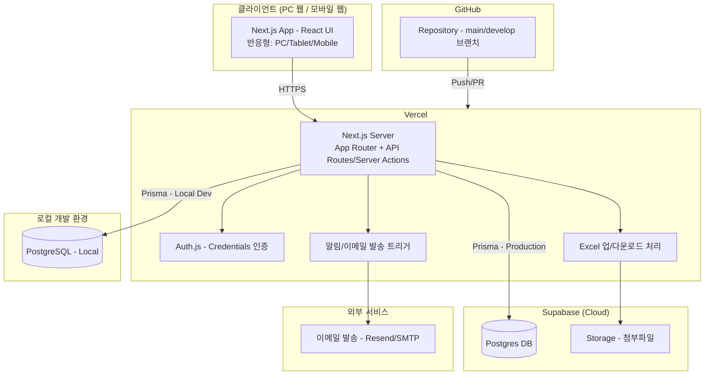

# 02. 기술 아키텍처 설계

## 1. 기술 스택

| 영역 | 선택 기술 | 선정 사유 |
|---|---|---|
| Frontend | Next.js 14+ (App Router, TypeScript) | SSR/CSR 혼용, Vercel 배포 최적화, API Route로 백엔드 겸용 |
| UI | Tailwind CSS + shadcn/ui | 커스터마이징 자유도, 반응형 유틸리티, 관리자 화면 생산성 |
| 캘린더 엔진 | FullCalendar (React) | 년/월/주/일 뷰, 반복일정, 드래그 이동을 표준 지원 — 직접 구현 대비 개발기간 절감 |
| 상태관리 | TanStack Query(서버 상태) + Zustand(테마 등 클라이언트 상태) | 캐싱/재검증 자동화, 가벼운 전역 상태 |
| ORM | Prisma | 로컬 PostgreSQL ↔ Supabase Postgres 동일 스키마로 마이그레이션 일원화 |
| 인증 | Auth.js(NextAuth) Credentials Provider + bcrypt | 이메일 없는 ID/PW 자체 가입 요구사항과 부합 (하단 2. 참고) |
| DB (로컬) | PostgreSQL 15+ | 개발 환경 |
| DB/Storage (클라우드) | Supabase (Postgres, Storage) | 관리형 Postgres + 파일 스토리지(첨부파일) 동시 제공 |
| 엑셀 처리 | `exceljs` | 업/다운로드 서식 컨트롤 용이 |
| 이메일 발송 | Resend 또는 Nodemailer+SMTP | 일정 알림 메일 (Phase 2 이후) |
| 배포 | GitHub → Vercel (CI/CD 자동) | 요구사항 그대로 |
| 암호화 | bcrypt(비밀번호), AES-256-GCM(쪽지 본문) | 단방향/양방향 암호화 요구사항 분리 대응 |

## 2. 인증 아키텍처에 대한 중요 설계 결정

**Supabase Auth를 사용하지 않고, 자체 Credentials 인증을 구현합니다.**

- 이유: 요구사항 상 가입은 "ID/이름/비밀번호"만으로 이루어지며, 이메일은 필수가 아니고 추후 알림 목적으로만 선택 등록됩니다. Supabase Auth는 기본적으로 이메일(또는 전화번호) 기반 가입을 전제로 하므로, 이를 억지로 맞추려면 `{id}@internal.local` 같은 가짜 이메일을 생성해야 하는 등 우회가 필요합니다.
- 대안: `users` 테이블을 직접 설계하고, Auth.js Credentials Provider로 로그인 처리 → JWT 세션 발급. 비밀번호는 bcrypt로 해시하여 `users.password_hash`에 저장.
- 트레이드오프: Supabase의 Row Level Security(RLS)는 `auth.uid()` 기반이라 자체 인증에서는 그대로 활용이 어렵습니다. → **모든 DB 접근은 서버(Next.js API Route/Server Action)를 경유**시키고, DB 접근 시 Service Role 권한을 사용하며 **애플리케이션 레벨에서 권한 검증**을 수행합니다. (RLS는 최소한의 방어선으로 "서버만 접근 가능" 정책 정도만 설정)

## 3. 시스템 구성도



## 4. 환경 전략 (로컬 → 클라우드)

| 구분 | 로컬 개발 | 클라우드(운영) |
|---|---|---|
| DB | PostgreSQL (Docker 권장) | Supabase Postgres |
| 연결 | `DATABASE_URL` (localhost) | `DATABASE_URL` (Supabase Connection Pooling, PgBouncer 경유) |
| 파일 저장 | 로컬 파일시스템 또는 Supabase Storage 개발용 버킷 | Supabase Storage |
| 배포 | 로컬 `next dev` | Vercel Preview(브랜치별) / Production(main) |
| 환경변수 | `.env.local` | Vercel Project Environment Variables |

- Prisma 스키마는 로컬/클라우드 공통 사용, `prisma migrate dev`(로컬) → `prisma migrate deploy`(운영, Vercel 빌드 파이프라인 또는 GitHub Actions에서 실행)
- Supabase 연결 시 Serverless 환경(Vercel)의 커넥션 폭주를 막기 위해 **반드시 Connection Pooling(포트 6543, pgbouncer=true) 사용**

## 5. 폴더 구조 (예시)

```
project-calendar/
├─ prisma/
│  ├─ schema.prisma
│  └─ migrations/
├─ src/
│  ├─ app/
│  │  ├─ (auth)/login, /signup
│  │  ├─ (main)/calendar/[view]      # year/month/week/day
│  │  ├─ (main)/dashboard
│  │  ├─ (main)/messages
│  │  ├─ (admin)/users, /groups, /projects, /audit-logs
│  │  └─ api/                        # REST API Route Handlers
│  ├─ components/
│  │  ├─ calendar/
│  │  ├─ layout/                     # Sidebar, TopNav, MobileNav
│  │  └─ ui/                         # shadcn/ui 커스텀
│  ├─ lib/
│  │  ├─ auth.ts                     # Auth.js 설정
│  │  ├─ prisma.ts
│  │  ├─ crypto.ts                   # bcrypt / AES 유틸
│  │  └─ excel.ts
│  └─ styles/
├─ .env.local
└─ vercel.json
```

## 6. CI/CD 흐름
1. 로컬에서 기능 개발 → GitHub `feature/*` 브랜치 Push
2. PR 생성 → Vercel Preview 자동 배포(리뷰용 URL 생성)
3. `develop` merge → 통합 테스트
4. `main` merge → Production 자동 배포 + Prisma Migration 자동 실행(빌드 훅)
