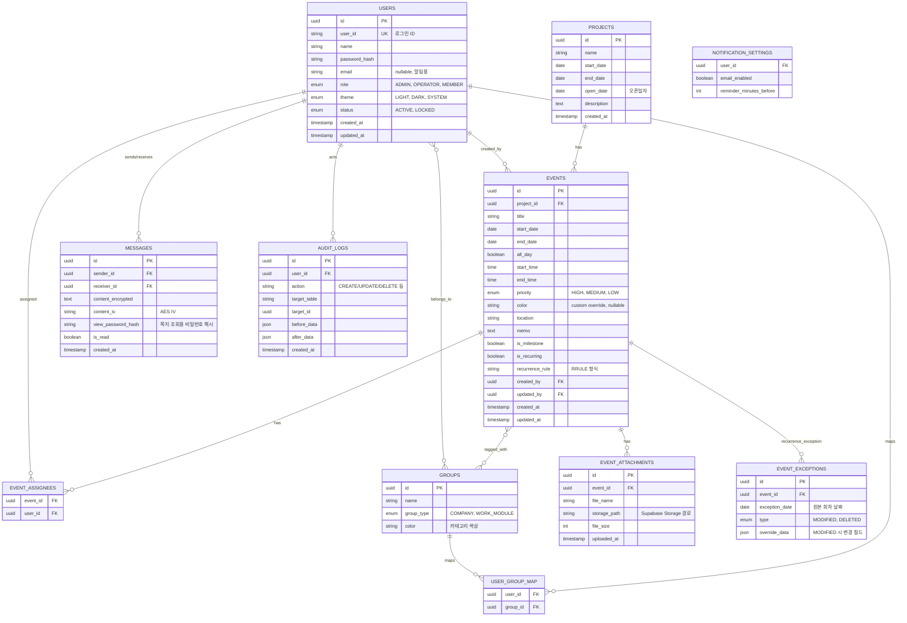

# 03. 데이터베이스 설계

## 1. ERD

## 2. 테이블 설계 상세 노트

### 2.1 `users`
- `user_id`: 로그인용 아이디, 유니크 제약
- `password_hash`: bcrypt(cost factor 10~12) 해시값, 원문 저장 금지
- `email`: nullable — 2단계(알림 기능) 도입 전까지 비워둘 수 있음
- `status = LOCKED`: 관리자가 강제 초기화 처리 시 임시 상태로 전환 가능 (다음 로그인 시 비밀번호 변경 강제)

### 2.2 `events` / 반복일정 처리 전략
- `recurrence_rule`은 iCalendar **RRULE** 표준 문자열로 저장 (예: `FREQ=WEEKLY;BYDAY=MO;UNTIL=20261231`)
- 화면에는 규칙을 서버/클라이언트에서 **전개(expand)** 하여 가상의 occurrence로 렌더링 (DB에 매 회차를 물리적으로 생성하지 않음 → 데이터량 절감)
- 특정 1회차만 수정/삭제가 필요한 경우 `event_exceptions` 테이블에 예외 기록 (원본 규칙은 유지, 특정 날짜만 override)

### 2.3 `event_assignees` / 그룹 다중 지정
- 이벤트-담당자는 N:M (`event_assignees`), 이벤트-업무그룹도 N:M (별도 매핑 테이블, ERD의 `EVENTS }o--o{ GROUPS`)

### 2.4 `groups` / `user_group_map`
- `group_type`으로 "조직 그룹(회사/부서)"과 "업무그룹"을 한 테이블에서 타입 구분하여 관리 (역할은 `users.role`로 별도 관리)
- 그룹별 `color`를 지정하여 캘린더 좌측 필터 목록에서 카테고리 색상으로 활용 (첨부 디자인 참고)

### 2.5 `messages` (쪽지)
- 본문은 AES-256-GCM으로 암호화하여 `content_encrypted` + `content_iv` 저장
- **조회용 비밀번호**는 발신자가 쪽지 작성 시 별도 설정 → `view_password_hash`(bcrypt)로 저장, 수신자가 열람 시 해당 비밀번호를 입력해야 복호화 진행
  - 권장 구현: 조회 비밀번호로부터 파생한 키(KDF)로 실제 암호화하면 비밀번호 검증과 복호화를 동시에 처리 가능 (단순 해시 비교만으로는 복호화 키를 별도 관리해야 함에 유의)

### 2.6 `audit_logs`
- 일정/사용자/그룹 등 주요 엔티티의 변경 전/후 데이터를 JSON으로 스냅샷 저장 → 관리자 조회 화면에서 "누가/언제/무엇을" 추적

## 3. 인덱스 권장
- `events(project_id, start_date, end_date)` — 뷰 조회 성능
- `events(is_milestone)` — 주요 이벤트 모아보기
- `users(user_id)` UNIQUE
- `messages(receiver_id, is_read)` — 미확인 쪽지 카운트
- `audit_logs(target_table, target_id, created_at)`
